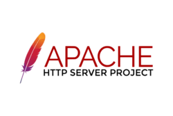
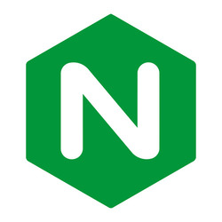
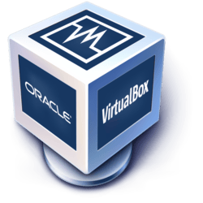

## Basic Terminology
---
### What is a web server?
A **web server** is software that delivers web pages to users by handling HTTP requests from clients like browsers.

### What is Apache?
**Apache** is a widely used open-source web server application. It’s known for its flexibility, supports various modules, and runs on multiple operating systems. It’s part of the Apache Software Foundation and has been a go-to choice for serving websites for decades.

### What are some example web server applications?

| Application Name     | License                       | Project's Website                   |
| -------------------- | ----------------------------- | ----------------------------------- |
| Apache HTTP Server   | Apache License 2.0            | [Apache](https://httpd.apache.org) |
| Nginx                | 2-clause BSD license          | [Nginx](https://nginx.org)         |
| Lighttpd             | BSD license                   | [Lighttpd](https://www.lighttpd.net) |

#### Apache HTTP Server  
  
As stated above, **Apache** is one of the most common web servers. It’s reliable, customizable, and supports features like URL rewriting, load balancing, and virtual hosts.

#### Nginx  
  
**Nginx** is a lightweight and super fast web server that is often used as a reverse proxy or load balancer in high-traffic environments.

#### Lighttpd  
  
**Lighttpd** is designed to be secure, fast, and lightweight. It’s great for serving static content and works well on low-resource systems.

### What is virtualization?
**Virtualization** is the process of running multiple operating systems on a single physical machine by using software to simulate hardware environments.

### What is VirtualBox?
  
**VirtualBox** is a free and open-source virtualization tool developed by Oracle. It lets users run different OSes in virtual machines on their computer.

### What is a virtual machine?
A **virtual machine** (VM) is a software-based emulation of a physical computer. It runs an OS and applications like a normal computer but inside a host system.

### What is Ubuntu Server?
  
**Ubuntu Server** is a Linux distribution designed for servers. It’s open-source, stable, and commonly used for hosting websites, cloud services, and more.

### What is a firewall?
A **firewall** is a security system that controls incoming and outgoing network traffic. It helps block unauthorized access while allowing legitimate communication.

### What is SSH?
**SSH** (Secure Shell) is a protocol used to securely connect to remote machines. It encrypts all data, making remote administration safe over networks.

## Other Relevant Concepts

* #### Systemd  
**Systemd** is the default system and service manager for many Linux distributions. It handles boot processes, service management, and system logging.

* #### Systemctl  
**Systemctl** is the command-line tool used to interact with systemd. You can start, stop, enable, or check the status of services with it.

* #### Virtual hosts  
**Virtual hosts** allow a web server to host multiple websites on a single machine. Each site can have its own domain and settings, even if they share the same IP.

* #### Log file  
A **log file** records events that happen on a system or application. Web server logs, for example, keep track of page requests, errors, and other activity.
