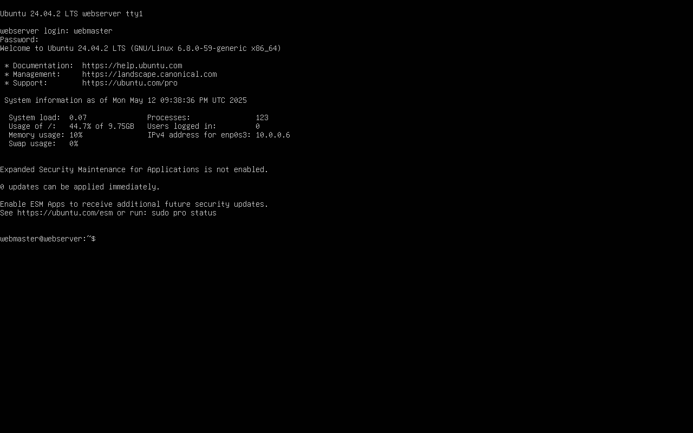
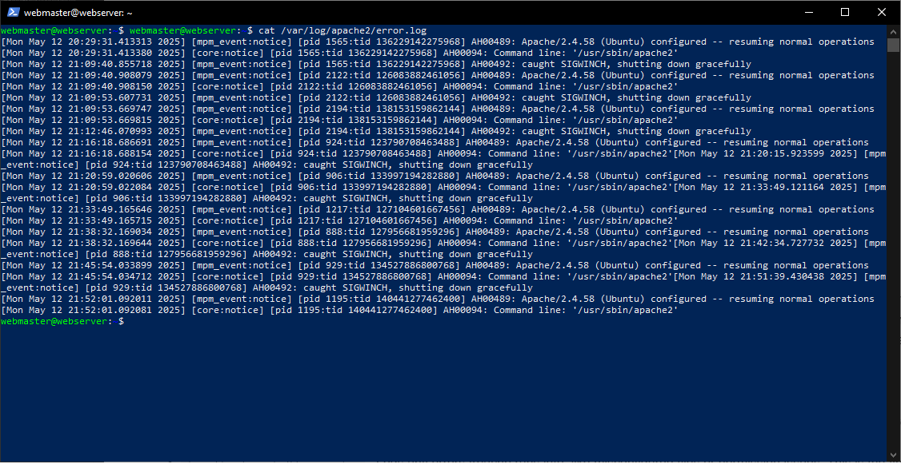

# Deliverable 2 Submission

## Server Specifications


## Ubuntu Login Screen


## Questions
3. ### What is the IP address of your Ubuntu Server Virtual Machine?
    10.0.0.6
    I used the `ip a` command to find the IP address

    #### Definition:
    The `ip a` command lists all IP addresses assigned to the system's network interfaces.

    #### Syntax:
    `ip a`

    #### Examples:
    ```
    ip a
    ip addr show
    ```
---

4. ### How do you enable the Ubuntu Firewall?
    `sudo ufw enable`
    
    #### Definition:
    `ufw` stands for Uncomplicated Firewall. It's a simple interface for managing iptables-based firewalls on Ubuntu.

    #### Syntax/Example:
    `sudo ufw enable`

---

5. ### How do you check if the Ubuntu Firewall is running?
    `ufw status`

    #### Syntax:

    `sudo ufw status`

    #### Examples:

    ```
    sudo ufw status
    sudo ufw status -v
    ```

---

6. ### How do you disable the Ubuntu Firewall?
    `ufw disable`

    #### Syntax/Example:
    `sudo ufw disable`


---

1. ### How do you add Apache to the Firewall?

    `ufw allow 'Apache'`

    #### Syntax:

    `ufw allow <package-name>`

    #### Examples:

    ```
    sudo ufw allow 'Apache'
    sudo ufw allow ssh
    ```

---

1. ### What is the command you used to install Apache?

    `apt install apache2`

    #### Definition:

    `apt` is a command-line tool for handling packages in Ubuntu and Debian systems.

    #### Syntax:

    `sudo apt install <package-name>`

    #### Examples:

    ```
    sudo apt install apache2
    sudo apt install curl
    ```

---

9. ### What is the command you use to check if Apache is running?

    `systemctl status apache2`

    #### Definition:

    `systemctl` is used to examine and control the systemd system and service manager.

    #### Syntax:

    `sudo systemctl status <service-name>`

    #### Examples:

    ```
    sudo systemctl status apache2
    sudo systemctl status ssh
    ```

---

10. ### What is the command you use to stop Apache?

    `systemctl stop apache2`

    #### Syntax:

    `sudo systemctl stop <service-name>`

    #### Examples:

    ```
    sudo systemctl stop apache2
    sudo systemctl stop ssh
    ```

---

11. ### What is the command you use to restart Apache?

    `systemctl restart apache2`

    #### Syntax:

    `sudo systemctl restart <service-name>`

    #### Examples:

    ```
    sudo systemctl restart apache2
    sudo systemctl restart ssh
    ```

---

12. ### What is the command used to test Apache configuration?

    `apachectl configtest`

    #### Definition:

    `apachectl` is a control interface for the Apache HTTP Server. The `configtest` option checks the Apache configuration for syntax errors.

    #### Syntax/Example:

    `sudo apachectl configtest`

---

13. ### What is the command used to check the installed version of Apache?
    `apachectl -v`

    #### Syntax:

    `apachectl -v`

    #### Examples:

    ```
    apachectl -v
    apache2 -v
    ```
---

14. ### What are the most common commands to troubleshoot Apache errors? Provide a brief description of each command.
    - `journalctl -xe` - Shows system logs including detailed errors related to services like Apache. Helpful if Apache won't start or fails silently.
    - `sudo apachectl configtest` - Tests Apache's configuration files for syntax errors. If something is off, it will usually tell you what and where.
    - `tail -f /var/log/apache2/error.log` - Live view of the error log. Great for watching what happens in real time when you restart Apache or visit a webpage.

---

15. ### Which are Apache Log Files, and what are they used for? Provide examples and screenshots.
    Apache typically logs activity in two main files:

    - `/var/log/apache2/access.log` - Records every request made to the server. It logs things like the user's IP, requested URL, response status, and browser info. Useful for traffic analysis and seeing what pages are getting hit.
    - `/var/log/apache2/error.log` - Logs any errors Apache runs into, like misconfigured files or permission issues. This is the first place to check when something goes wrong.

These logs help with debugging, monitoring traffic, and even detecting suspicious activity.

### Screenshots 

#### access.log


#### error.log
